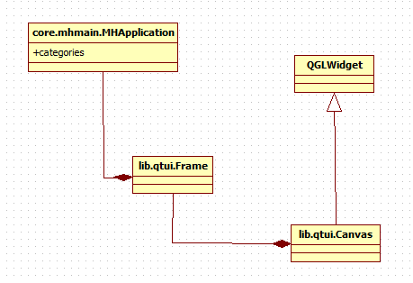

Basics of event handling in Makehuman
*************************************

Makehuman is a GUI based, interactive, Qt application in which objects interact by sending messages to each other. The Qt class QEvent encapsulates notion of low level events like mouse events, key press events, action events, etc. A Qt application is event loop-based, which is basically a program structure which allows events to be prioritized, queued and dispatched to application objects.   

In a Qt based application, there are different sources of events. Some events like key events and mouse events come from window system, while some others originate from within application. When an event occurs, Qt creates an event object to represent it by constructing an instance of the appropriate QEvent subclass, and delivers it to a particular instance of QObject (or one of its subclasses) by calling its event() function. This function does not handle the event itself, but rather, it calls an event handler based on the type of event delivered, and sends an acknowlegement based on whether the event was accepted or ignored.

QCoreApplication::exec() method enters the main event loop and waits until exit() is called. It is necessary to call this function to start event handling. In MH, it is done in lib.qtui.Application which inherits from QApplication which in turn inherits from QCoreApplication::

    def start(self):
            self.OnInit()
            self.callAsync(self.started)
            self.messages.start()
            self.exec_()

In MH, event handling falls in two broad categories.

- Event handling for containers (application, categories, taskviews)
- Event handling for widgets (contained in containers)

Event handling for containers
===============================

MH is organized hierarchically in the context of containers.  At top is the main application (:class:`core.mhmain.MHMainApplication`).  It contains categories (core.gui.Category), which in turn contains taskviews (core.gui.TaskView).

In a Qt-based application, there are five different ways of events processing, as listed below:

1. Reimplementing an event handler function like paintEvent(), mousePressEvent() and so on. This is the most common, easiest, but least powerful approach.
2. Reimplementing QCoreApplication::notify ( QObject * receiver, QEvent * event ).  This is very powerful, providing complete control; but only one subclass can be active at a time.  
   Qt's event loop and sendEvent() calls use this approach to dispatch events.
3.  Installing an event filter on QCoreApplication::instance().  Such an event filter is able to process all events for all widgets.  It's just as powerful as reimplementing notify();
   furthermore, it's possible to have more than one application-global event filter. Global event filters even see mouse events for disabled widgets. 
   Note that application event filters are only called for objects that live in the main thread. [I believe that MH is single threaded - implications?  RWB]
4. Reimplementing QObject::event() (as QWidget does). 
   If you do this you get Tab key presses [<--Explain what is special about TAB and shift-TAB presses ?- RWB], and you get to see the events before any widget-specific event filters.
5. Installing an event filter on the object itself.  Such an event filter gets all the events, including Tab and Shift+Tab key press events [<--Explain what is special about TAB and shift-TAB presses ?- RWB], as long as they do not change the focus widget.

In MakeHuman, approaches 2 and 4  are used for extensively for event handling.  As part of strategy 2,in lib.qtui.Application (which extends QApplication), notify has been reimplemented: [I don''t understand the implication of this? Expond? -RWB]::

    def notify(self, object, event):
            self.logger_event.debug('notify(%s, %s(%s))', object, event, event.type())
            return super(Application, self).notify(object, event)
        
object is the receiver object. Class implementing notify has to be singleton.  [Clarify? - RWB]

In MakeHuman, MHApplication subclasses lib.qtui.Application.MHApplication object is the main application object. It's notify function receives notification from the event loop in the underlying Qt layer about each [container only or widgets too?] event, which is then relayed to receiver object's event method. The receiver object's event method is either inherited from QObject or reimplemented. The Receiver object then either sends TRUE or FALSE, as the case may be, to [WHERE??] - RWB

lib.qtui.Application also implements an event function, which is called if the receiver object is MHApplication object itself.  Then, lib.qtui.Application.event() checks if its a user-defined event or not,and it is so true is returned, else we call super class's event().   In case of true being returned,Qt dispatches event to receiver object's callEvent function which determines which function to be called on object to handle the event. Called function then handles the event or propagate it to its parent(or to current task if its application object), as may seem fit.

Event handling for widgets
=============================

Most of MH widgets are wrappers around Qt widgets. These widgets (defined in module lib.qtgui) inherit from the respective Qt widgets and the Widget class (lib.qtgui.Widget).  MH makes use of signal and slot mechanism by making the connection between the signal originating from the Qt layer and the corresponding handler function. For example, class TabBase connects the signal 'currentChanged' to its function 'tabChanged' as follows::

    class TabsBase(Widget):
        def __init__(self):
            super(TabsBase, self).__init__()
            self.tabBar().setExpanding(False)
            self.connect(self, QtCore.SIGNAL('currentChanged(int)'), self.tabChanged)

        
Any class inheriting from TabsBase(e.g., lib.qtgui.Tabs or lib.qtgui.TabBar) also gets this facility.  So now whenever signal 'currentChanged' is emitted from Qt layer function 'tabChanged' is called. The result is that when a user clicks the mouse on a tab, the 'tabChanged' code  will be called,

Similarly, MH Slider widget connects various slider operations to its event handling functions as::

    self.connect(self.slider, QtCore.SIGNAL('sliderMoved(int)'), self._changing)
    self.connect(self.slider, QtCore.SIGNAL('valueChanged(int)'), self._changed)
    self.connect(self.slider, QtCore.SIGNAL('sliderReleased()'), self._released)
    self.connect(self.slider, QtCore.SIGNAL('sliderPressed()'), self._pressed)

  
Overriding vs event decorators
===============================

The View, Category and Application classes inherit from events3d.EventHandler, hence they have callEvent() function.  The events that apply to this category are usually application-wide. If user make a change that impacts the whole application, and whole application must know about this change, then best way to do so is to call callEvent() for all the taskviews of the application,as follows::

    for category in self.categories.itervalues():
        for task in category.tasks:
            task.callEvent('onMyEvent', params)

A good example is the event of makehuman's scene changing(core.qtui.MHApplication._sceneChanged).  So when callEvent is called on a taskview object and it has onMyEvent implemented,it is being called.  In core.gui3d.View too one can see that most of the events (onShow, onMouseDown,...) on the taskview are propagated by default to their parents - the categories. The categories also are views, so the events are propagated again to their parent, the application. If, again, the application or any category has an onMyEvent method, it is executed.

There are some events that affect the application, but only a single task at a time,for example onMouseDown event. It only happens to the active taskview
(the others are hidden, so they receive no mouse events). Once the mouse is pressed, an Application.currentTask.callEvent("onMouseDown", event) is issued. This causes the onMouseDown event to be received by the active Taskview, its parent Category, and finally the Application. This call executes any onMouseDown method in these objects.

Apart from the Category events described above, there are events used for local purposes.  Such events are handled with event decorators.  Suppose we have a new Taskview, FooTaskView. This Taskview has a 'mybar' member variable, which is of type Bar(events3d.eventHandler).  The requirement is that when self.mybar executes code, we may want to communicate with its parent to inform it about an event that just happened. So, inside the code for Bar, is located a 'self.callEvent('onBaz', 42)' command.  Thus, in the Bar class, we emit a timely event signal and use the event decorator to let the parent Taskview know about the event.  In the  FooTaskView class, but below the place where self.mybar is created, we add::

    @self.mybar.mhEvent
    def onBaz(event):
        # code on event.
        # guess what, event == 42.

When now the self.mybar Bar reaches that callEvent, the above method, located in FooTaskView, will be executed.

core.mhmain.MHApplication's human is perfect example of this approach.Human has onMouseDown event handler and we need to relay it to application.
In loadMainGui function of MHApplication, we add decorator to human attribute as::

    def loadMainGui(self):
            ..............
            
            @self.selectedHuman.mhEvent
            def onMouseDown(event):
              if self.tool:
                self.selectedGroup = self.getSelectedFaceGroup()
                self.tool.callEvent("onMouseDown", event)
              else:
                self.currentTask.callEvent("onMouseDown", event)
            .............    

Application.human.onMouseDown event is caught and it starts its trip from the Human; it is captured by the decorated method located in Application.loadMainGui (this is the place where the method is bound with the event), it is sent to the currentTask, propagated through the parent category, and finally reaches its destination, the Application.

A more intense process happens on Human.onChanged. This is emitted when a save/load happpens, so the whole application has to know. So it starts from the human, captured by the decorated method in app, sent to ALL the taskviews in MH, and finally through the categories again to the app.

 
The MakeHuman Graphical User Interface (GUI)
===============================================

The MakeHuman GUI is based on the pyQt library which, in turn, is built on the Qt library.   Qt is a development framework for the creation of applications and user interfaces for desktop.

Important GUI classes in MakeHuman are:

lib.qtui.Canvas
-----------------

This is the class in MakeHuman which takes care of rendering openGL graphics.It inherits from Qt's QGLWidget class which is a widget for rendering OpenGL graphics.  QGLWidget provides functionality for displaying OpenGL graphics integrated into a Qt application. It is very simple to use. You inherit from it and use the subclass like any other QWidget, except that you have the choice between using QPainter and standard OpenGL rendering commands.  

The Canvas class reimplements three functions from parent class to perform openGL tasks:

- paintGL() - Renders the OpenGL scene. It gets called whenever the widget needs to be updated.
- resizeGL() - Sets up the OpenGL viewport, projection, etc. Gets called whenever the widget has been resized (and also when it is shown for the first time because all newly created widgets get a resize event automatically).
- initializeGL() - Sets up the OpenGL rendering context, defines display lists, etc. Gets called once before the first time resizeGL() or paintGL() is called.

lib.qtui.Application
---------------------
This is the foundation class which manages GUI's control flow and main settings. It inherits from QtGui.QApplication and events3d.EventHandler.  QApplication contains the main event loop, where all events from the window system and other sources are processed and dispatched. It also handles the application's initialization and finalization.Application class holds gui main window(instance of lib.qtui.Frame). Application class receives event notifications from underlying Qt user intrface framework and dispatches them to appropriate user intrface elements in MakeHuman.

   GUI architecture in MakeHumanMH can be depicted as follows

