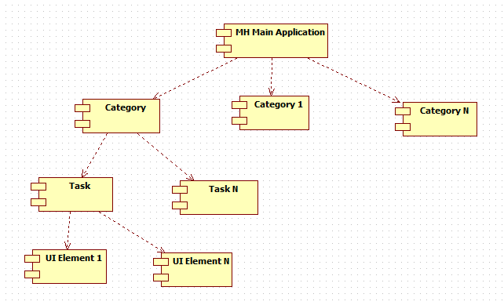
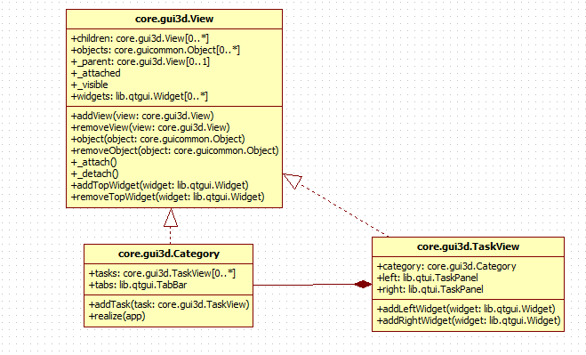

.. _modulegui3d:

******************
The Gui3D Module
******************

Category,TaskView
======================================
In MH, an artist can perform various operations on a humanoid.Broadly we can divide these operations in groups as follows:
Modelling - for physical modifications in humanoid
Geometries - for additional aspects like hair,teeth etc
Materials - for materials selection
Pose/animate - for rigging etc
Rendering

In MH,these groups are termed as categories. And activities grouped under a category are called as tasks. So each task represents a specific activity.
Like,gender is a task under Modelling category which allows user to make gender specific modelling.
MH is organized with main application at top and categories under it, and tasks arranged under each category.
For each task, various widget elements are provided for user interaction.These include GUI elements like sliders, buttons,check boxes etc.
We can visualise MH as a tree structure with main application sitting at top, categories under it, tasks under respective category and UI elements stacked inside a
task.

   
   MakeHuman component architecture
   
At code level, a task and a category is classified as a View(core.gui3d.View). A view can be looked upon as a container for other MH elements. So a category is
a view as it contains tasks, while a task is also a view as it contains UI elements. 
   

   
   MakeHuman view hierarchy
   
Every view has  following attributes:

class View(events3d.EventHandler):

    def __init__(self):

        self.children = []
        self.objects = []
        self._visible = False
        self._totalVisibility = False
        self._parent = None
        self._attached = False
        self.widgets = []
		
children are the views a view contains.
objects are 3D rendering objects will be rendered in the opengl canvas
visible is a flag to keep track of visibility of view
parent is the MH element this view belongs to
widgets are the associated UI elements
_totalVisibility is an implementation detail hidden from the public interface. It's used to determine the isVisible() status. A View with a parent is only 
visible if its own visibility flag is true, and its parents are visible as well.

When a view is attached, then all of its children and objects are also attached, and same holds true when it is detached.

def _attach(self):
        self._attached = True

        for object in self.objects:
            object._attach()

        for child in self.children:
            child._attach()

def _detach(self):
        self._attached = False

        for object in self.objects:
            object._detach()

        for child in self.children:
            child._detach()

When a view is added,if this view is attached to the app, the view will also be attached.
			
def addView(self, view):        
        if view.parent:
            raise RuntimeError('The view is already added to a view')

        view._parent = weakref.ref(self)
        view._updateVisibility()
        if self._attached:
            view._attach()

        self.children.append(view)

        return view
			
Similarly,while removing a view from this view,if this view is attached to the app, the view will be detached.	
Just like for view, add/remove functions are also available for member objects, and have behaviour in terms of attachment/detachment. When an object id added to 
this view,if the view is attached to the app, the object will also be attached and will get an OpenGL counterpart.
While removing the object from the view,if the object was attached to the app, its OpenGL counterpart will be removed as well.

A view can also have widgets associated to it. So there is a list for holding widgets,self.widgets.Methods are provided to add/remove widget to/from a view,
which are addTopWidget/removeTopWidget. These methods also call function to add widget to the main window(lib.qtui.Frame) of the application.

View class also has many event handling functions like onShow,onHide and various mouse related events.

In MH, as discussed above we have concept of Task which basically represents a very specific activity domain in MH concerns.Like we have 'Face' task under 
'Modelling'.At code level, a task is represented by TaskView(core.gui3d.TaskView). A TaskView inherits from View. In addition it has several more attributes.

class TaskView(View):

    def __init__(self, category, name, label=None):
        super(TaskView, self).__init__()
        self.name = name
        self.category = category
        self.label = label
        self.focusWidget = None
        self.tab = None
        self.left, self.right = mh.addPanels()
        self.sortOrder = None

name is taskview's name
category is the category to which this taskview belongs
tab is the instance of lib.qtgui.Tab, refering to tab in parent category to which this task is assigned
left and right are the panels(lib.qtui.TaskPanel) for the taskview which are added to main window(lib.qtui.Frame).TaskPanel inherits from lib.qtgui.VScrollArea,
which in turn contains a scroll bar(QtGui.QScrollBar).
Any widget we want to have for a taskview,we add to these panels.

def addLeftWidget(self, widget):
        return self.left.addWidget(widget)

def addRightWidget(self, widget):
        return self.right.addWidget(widget)
		
Similarly, we also have functions to remove widgets from a taskview.

In MH, a category is a group of domain specific tasks.Like Modelling is is a category with various tasks under it. At code level, a category is represented by
core.gui3d.Category and it also inherits from View just like TaskView.

class Category(View):

    def __init__(self, name, label = None):
        super(Category, self).__init__()
        self.name = name
        self.label = label
        self.tasks = []
        self.tasksByName = {}
        self.tab = None
        self.tabs = None
        self.panel = None
        self.task = None
        self.sortOrder = None
		
tabs(lib.qtgui.TabBar) is for adding tabs, with each tab assigned to a member task present in self.tasks
tasks is the list of associated taskviews
task is the name of the current task.
Category has function addTask() to add task to it.
Another important function is realize(), which adds all member tasks to tab bar.   

.. automodule:: gui3d
    :members:

