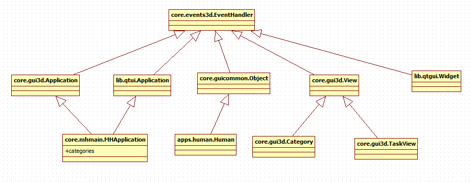

Structural Organization of MakeHuman
*************************************

Application, categories, tasks.
================================
MakeHuman is organized hierarchically, using three types of high-level containers:

- Application (child of :class:`gui3d.Application` and :class:`qtui.Application`)
- Categories (:class:`gui3d.Category`)
- TaskViews (:class:`gui3d.TaskView`)

These elements are used to contain gui elements (object and widgets, see below) and put event handlers on them. 

Application
-------------
The object Application is used to create the main base `singleton <http://en.wikipedia.org/wiki/Singleton_pattern>`_ of MakeHuman: :class:`mhmain.MHApplication`, that handles rendering of objects and the graphical interface.
It has many properties, but in particular three of them are fundamental:
 
- self.children, used to store taskviews
- self.categories, used to store categories
- self.objects, used to store objects.

Category and TaskView
----------------------
As said, category and task view are high level containers. Both them are derived from the View object (:class:`gui3d.View`) that's basically the base visual context.
A TaskView is specialised View with panels and tab and a Category is a specialised View which contains multiple taskviews.
In context of MakeHuman interface, Category objects constitute the upper row of tabs while taskview objects constitute the lower row of tabs.   

Objects and widgets
====================

Objects (:class:`guicommon.Object`) and Widgets (:class:`qtgui.Widget`) are the elements enclosed in the containers described above.

As we have already seen, objects can be added and removed from the main Application. But also they can be added and removed from a Category or a TaskView. Every added guicommon.object has an openGL counterpart so it's used for human mesh, hair, clothes, etc.   

An important behaviour is that they inherit the visibility of their containers, so objects added to a taskview are only visible if the taskview is visible.  For example, a skeleton added to the skeleton chooser is only visible  when the skeleton chooser taskview is visible.  Following the same logic, objects added to main application are always visible.  Thus objects like human and all proxies such as clothes are added to the application, because they should always be visible. 

Visiblilty can be disabled by setting the visibility flag on objects but an object that is not added to a currently visible taskview, or the application, is not visible, even if its visibility flag is set positive.

An object can only be added to one context. So an object is either added to one taskview, or the application, not two different taskviews.

General structure in MH
=========================

Still to write.

   MakeHuman general structure  

  

